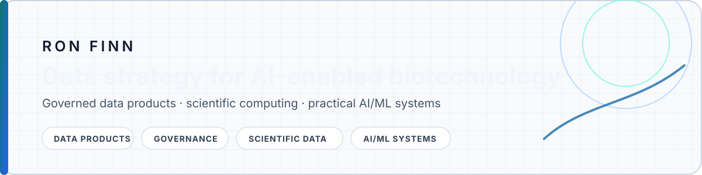

<picture>
  <source media="(prefers-color-scheme: dark)" srcset="./assets/profile-header-dark.svg">
  <source media="(prefers-color-scheme: light)" srcset="./assets/profile-header-light.svg">

</picture>

  <a href="https://www.linkedin.com/in/ron-m-finn/">LinkedIn</a>
  &nbsp;·&nbsp;
  <a href="https://github.com/DataGovLead?tab=repositories">Public repositories</a>
  &nbsp;·&nbsp;
  <a href="https://github.com/DataGovLead/AdvancedBiomedicalAgent">Flagship project</a>

  

## Profile

I design **governed, reusable data systems for AI-enabled biotechnology**. My work sits at the intersection of data strategy, scientific computing, data governance, and practical AI/ML enablement.

| Data strategy and governance | Scientific data systems |
|---|---|
| Data products, metadata, ownership, lineage, quality, privacy by design | Genomics, single-cell, spatial, imaging, clinical, and chemical data |
| **AI/ML enablement** | **Engineering** |
| Model-ready datasets, retrieval systems, evaluation assets, agent workflows | Python, SQL, APIs, workflow automation, cloud-native tooling |

## Selected public work

<!-- PROFILE:PROJECTS:START -->
| Project | Purpose | Stack | Status |
|---|---|---|---|
| **[Advanced Biomedical Agent](https://github.com/DataGovLead/AdvancedBiomedicalAgent)** | Integrates major public biomedical sources into PostgreSQL and exposes LLM-friendly search tools for drugs, targets, trials, safety, and regulatory data. | `Python` · `PostgreSQL` · `Biomedical data` · `AI agents` | Active |
<!-- PROFILE:PROJECTS:END -->

## Current interests

`AI-ready data products` · `data catalogues` · `metadata automation` · `single-cell` · `spatial transcriptomics` · `biomedical search` · `agentic tooling`

## Working principles

- Treat important datasets as owned, versioned, documented products.
- Co-version data, code, schemas, quality evidence, and provenance.
- Automate repeatable metadata and validation work; keep human accountability explicit.
- Prefer small, testable systems over impressive but fragile demos.

---

Public repositories shown here are independent open-source or learning projects. They do not contain or represent confidential employer or partner work. The selected-project table is generated from <code>profile.json</code> by GitHub Actions.
